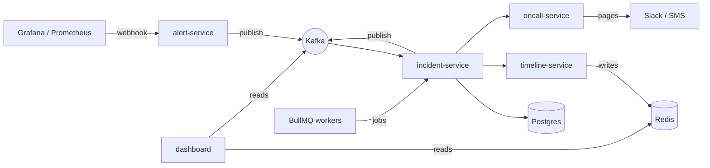

# Spectra Architecture

Spectra is a **microservice architecture** for observability, monitoring, alerting, and incident management. The system is split into independently deployable services that communicate through HTTP, Kafka events, Redis, and background jobs.

## Implemented Core Flow

The current runnable core uses the dashboard through `api-gateway`, with JWT-protected auth, incident, and dashboard APIs backed by the same Neon PostgreSQL database. The gateway routes `/api/auth/**`, `/api/incidents/**`, `/api/dashboard/**`, `/api/anomalies/**`, and `/api/ping/**` to environment-configured services. Registration and login are public; downstream services validate bearer tokens for protected operations.

Core service ports default to gateway `8080`, auth `8081`, incidents `8082`, dashboard `8083`, and ping `8084`. Set `DATABASE_URL`, `DATABASE_USERNAME`, `DATABASE_PASSWORD`, and a 32-character minimum `JWT_SECRET`; see the repository `.env.example` for the complete local configuration.

Implemented endpoints include `POST /api/auth/register`, `POST /api/auth/login`, `POST /api/auth/logout`, `GET /api/auth/me`, the incident CRUD/state-transition endpoints, `GET /api/dashboard/summary`, and `GET /api/ping`.

## Overview

## Service Map

- `alert-service` ingests alert webhooks from Grafana, Prometheus, and custom clients.
- `incident-service` creates and updates incidents, applies deduplication, and publishes incident events.
- `oncall-service` handles on-call rotations, acknowledgements, escalations, and paging.
- `timeline-service` stores the live incident timeline for fast dashboard reads.
- `dashboard-service` / `dashboard` presents the UI for incidents, metrics, and timelines.
- `auth-service` manages authentication and access control.
- `api-gateway` routes requests to the internal services.
- `service-registry` supports service discovery.
- `ping-service`, `scraper-service`, `anomaly-service`, and others extend the monitoring pipeline.

## Event Flow

1. A metric threshold is crossed in Grafana or Prometheus.
2. An alert webhook is sent to `alert-service`.
3. `alert-service` publishes `alert.fired` to Kafka.
4. `incident-service` consumes the event and creates or deduplicates an incident.
5. `oncall-service` pages the correct person based on the rotation.
6. The dashboard reads the live timeline from Redis and the event history from Kafka.
7. BullMQ workers generate SLA checks, weekly digests, and post-mortem drafts.

## Why This Is a Microservice Architecture

Spectra is not a monolith. Each capability is separated into a dedicated service with a focused responsibility:

- Ingestion is isolated from incident orchestration.
- On-call routing is separate from timeline storage.
- UI reads are separate from background jobs and event processing.
- Kafka provides the event backbone so services can evolve independently.

## Deployment Notes

- Services are intended to run independently behind a reverse proxy.
- Shared infrastructure includes Kafka, Redis, Postgres, and email/SMS integrations.
- The repo is designed for Docker Compose locally and CI/CD in production.

## Related Files

- [README.md](../README.md)
- [.github/workflows/ci.yml](../.github/workflows/ci.yml)
- [.gitignore](../.gitignore)
